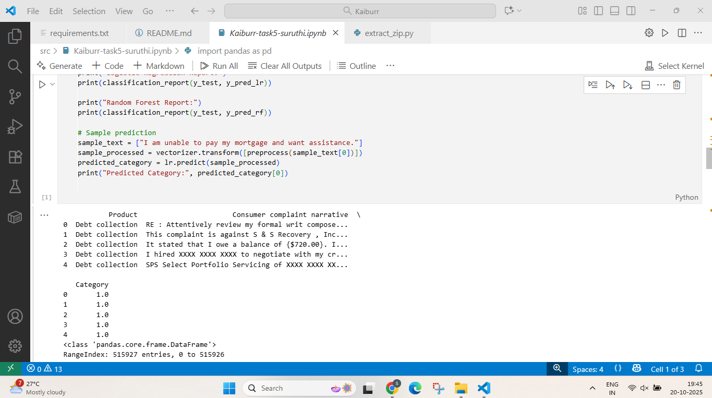
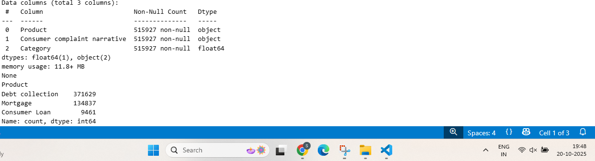
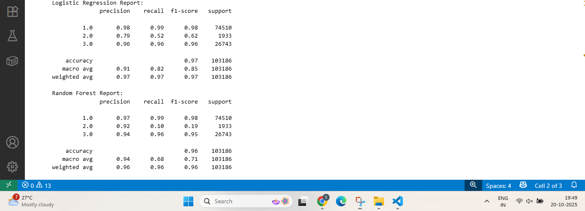
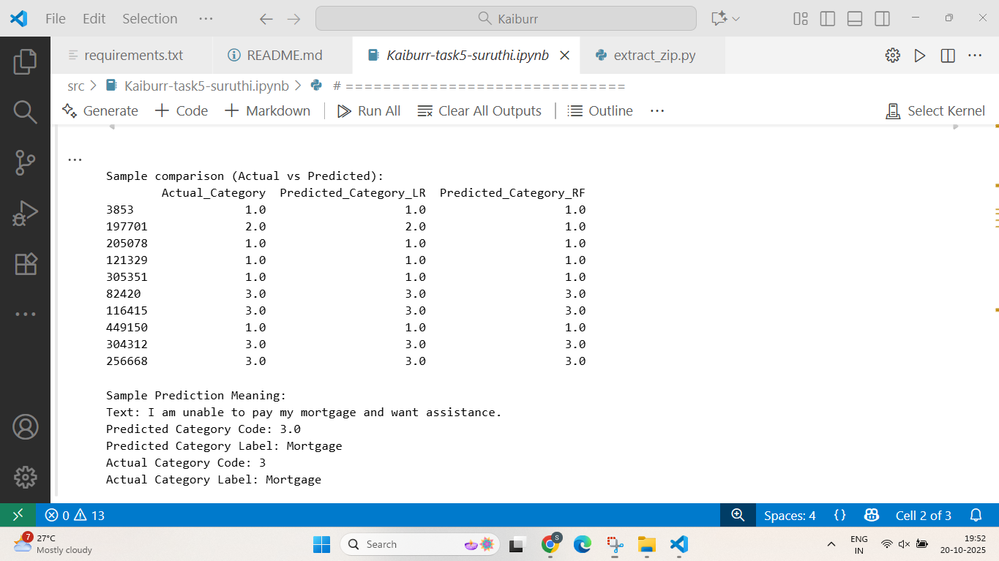

# Task 5: Text Classification on Consumer Complaint Dataset

## Overview
This project performs text classification on the Consumer Complaint Database dataset, classifying complaints into the following categories:
0 - Credit reporting, repair, or other  
1 - Debt collection  
2 - Consumer Loan  
3 - Mortgage

## Folder Structure


Task5_Text_Classification/
│
├── data/ # Dataset
│ └── complaints.csv
├── src/ # Python scripts
│ ├── preprocessing.py
│ ├── feature_engineering.py
│ ├── model_training.py
│ └── evaluation.py
├── screenshots/ # Screenshots
├── requirements.txt # Python dependencies
└── README.md # Project description + screenshots

## Dataset
**Note:** The CSV file is **not included** in this repository to keep it lightweight.  
You can download the dataset from:  
[Consumer Complaint Database CSV](https://catalog.data.gov/dataset/consumer-complaint-database)

Place the downloaded `complaints.csv` inside the `data/` folder before running the code.


## Steps Followed
1. Explanatory Data Analysis (EDA) and Feature Engineering
2. Text Pre-processing
3. Multi-class classification model selection
4. Model performance comparison
5. Model evaluation
6. Prediction

## How to Run
1. Install dependencies:
```bash
pip install -r requirements.txt
````

2. Open the notebook in VS Code or Jupyter Notebook:

```bash
jupyter notebook Task5-Text-Classification.ipynb
```

3. Run all cells step by step.

### Screenshots

| Description | Screenshot |
|-------------|------------|
| Dataset Rows |  |
| DataFrame Info |  |
| Logistic Regression Accuracy & Confusion Matrix | .png) |
| Random Forest Accuracy & Confusion Matrix | .png) |
| Classification Report |  |
| Sample Prediction |  |

